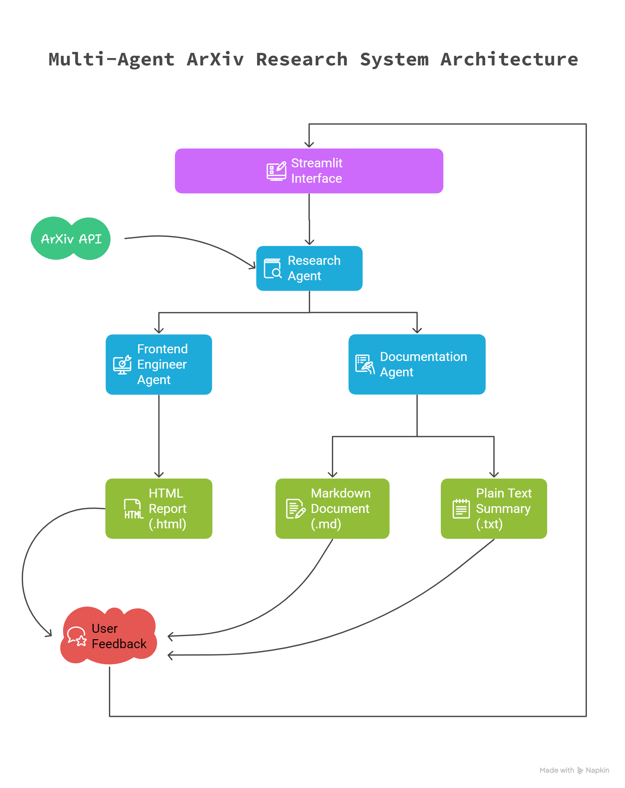

# Multi-agent-framework-for-ArXiv-paper-research

## Overview
------------------------
This framework is a multi-agent system designed to automate the process of discovering, analyzing, and ranking AI research papers from ArXiv. Leveraging the power of AI agents and large language models (LLMs) - both local LLMs and Google's gemini, this application (crew) automates the process of discovering, analyzing, and presenting cutting-edge research papers from arXiv.

The system consists of three specialized agents working together to provide a comprehensive research experience:

1. **Research Agent**: Analyzes and ranks AI research papers from arXiv based on innovation and impact potential
2. **Frontend Engineer Agent**: Generates professional HTML reports with responsive design and interactive elements
3. **Text Generation Agent**: Creates well-formatted text and markdown summaries for easy sharing and reference


## Architecture Diagram
------------------------



## Key Features
------------------------
- **Automated Research Discovery**: Automatically fetches the latest papers from arXiv
- **AI-Powered Analysis**: Evaluates papers based on innovation, methodology, and potential impact
- **Multi-Format Reports**: Generates reports in HTML, Markdown, and plain text formats
- **Interactive Web Interface**: Built with Streamlit for a clean, responsive user experience
- **Feedback System**: Provide feedback to refine agent outputs
- **Local Execution**: Can runs entirely on your local machine, even without a GPU, leveraging Deepminds: Gemma3:4B LLM model.
- **Multi-LLM Architecture**: Utilizes different LLMs for specialized tasks.

## How It Works
------------------------
1. **Paper Retrieval**: The system uses the `FetchArxivPapersTool` to fetch papers from ArXiv based on the selected date and categories.
2. **Analysis and Ranking**: A `Senior AI Researcher` agent evaluates the papers using a custom LLM (Language Model) and ranks them based on their significance.
3. **Report Generation**: A `Frontend Engineer` agent compiles the results into an interactive HTML report.
4. **Feedback Collection**: Users can provide feedback on the results, which is saved for future improvements.

## Installation
------------------------
1. Clone the repository:
   ```bash
   git clone https://github.com/nitanshuj/arxiv_research_assistant.git
   cd arxiv-research-assistant
   ```

2. Install dependencies:
   ```bash
   pip install -r requirements.txt
   ```

3. Install LM Studio:
   - Download and install LM Studio from the [official website](https://lmstudio.ai/).
   - After installation, download the required model (e.g., `gemma3:4b`) within LM Studio.

4. Set up environment variables:
   - Create a `.env` file in the root directory.
   - Add your API keys (e.g., OpenAI, Serper, LM Studio) as shown in the example `.env` file:
     ```
     OPENAI_API="your-openai-api-key"
     SERPER_API_KEY="your-serper-api-key"
     GOOGLE_API_KEY=your_google_api_key  # For Gemini models
     LM_STUDIO_KEY=lm-studio  # For local models via LM Studio
     ```

## Running
------------------------
This can be run both locally or using cloud llms like Gemini models, or even a hybrid models.

For completely local execution - this application is designed to run on a standard Windows PC without requiring a GPU. 
It leverages local LLM hosting via LM Studio for some or all agents.

For complete cloud execution - this application can use Google Gemini models using google-api-key.

### How to Run:

1. Start LM Studio: (only for local or hybrid execution)

   - Download and install [LM Studio](https://lmstudio.ai/)
   - Load a compatible model (e.g., Gemma 3 4B Instruct)
   - Start the local server on port 1234

2. Launch the application:

On the terminal

```bash
   streamlit run app.py
   ```

3. Access the web interface at `http://localhost:8501`

## How It Works
------------------------
The arXiv Research Assistant employs a CrewAI-based multi-agent framework:

1. **Research Analyst Agent** (Local LLM via LM Studio):
   - Fetches papers from arXiv based on date and categories
   - Analyzes content, methodology, and potential impact
   - Assigns innovation and impact scores
   - Ranks papers based on overall significance

2. **Frontend Engineer Agent** (Google Gemini):
   - Transforms research data into an aesthetically pleasing HTML report
   - Implements responsive design for optimal viewing on any device
   - Creates interactive elements for better user experience

3. **Documentation Agent or the Text Generation Agent** (Google Gemini):
   - Produces formatted text and markdown documents
   - Generates comprehensive summaries for each paper
   - Creates a well-structured table of contents in markdown


## Technologies Used
------------------------
- **CrewAI**: Framework for multi-agent orchestration
- **Streamlit**: Web interface and visualization
- **LM Studio**: Local LLM hosting
- **Google Generative AI**: Cloud-based LLM capabilities
- **arXiv API**: Research paper retrieval
- **Python**: Core programming language


## Customization
------------------------
- Modify `agentic_crews/arxiv_crew.py` to adjust agent configurations and LLM settings
- Edit `agentic_crews/tools/html_tool.py` to customize HTML report styling
- Update `agentic_crews/tools/text_tool.py` to change text report formatting

## Acknowledgments
------------------------
This mini-project is inspired by the article: [Building Your First AI Agent](https://levelup.gitconnected.com/building-your-first-ai-agent-that-will-actually-improve-you-as-an-ai-engineer-4cb99e590d30).